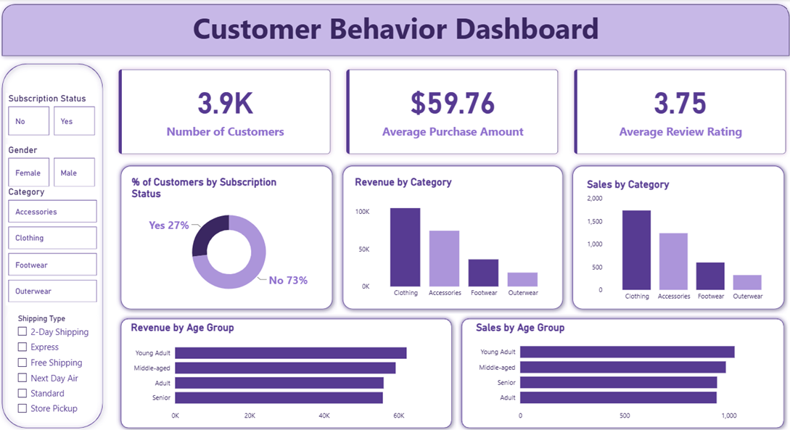

# Customer Shopping Behavior Analysis

Analyzing customer purchasing patterns, shopping preferences, and revenue trends using **Python, SQL, and Power BI**.

---

## Table of Contents

- [Overview](#overview)
- [Business Problem](#business-problem)
- [Dataset](#dataset)
- [Tools & Technologies](#tools--technologies)
- [Project Structure](#project-structure)
- [Data Cleaning & Preparation](#data-cleaning--preparation)
- [SQL Analysis](#sql-analysis)
- [Power BI Dashboard](#power-bi-dashboard)
- [Key Findings](#key-findings)
- [Project Report](#project-report)
- [Project Presentation](#project-presentation)
- [Author & Contact](#author--contact)

---

## Overview

This project analyzes customer shopping behavior to understand purchasing patterns, customer demographics, subscription trends, product performance, and revenue trends. The analysis was performed using Python for data cleaning and feature engineering, SQL for business analysis, and Power BI for interactive visualization and dashboard development.

---

## Business Problem

Retail businesses need to understand customer behavior to improve sales, customer engagement, and marketing strategies. This project aims to:

- Analyze customer purchasing behavior
- Identify high-performing product categories
- Understand customer demographics
- Evaluate subscription trends
- Analyze shipping preferences
- Identify customer segments
- Build an interactive dashboard for business insights

---

## Dataset

The dataset contains **3,900 customer purchase records** with **18 variables**.

The dataset includes information related to:

- Customer Demographics
- Product Categories
- Purchase Amount
- Review Ratings
- Subscription Status
- Shipping Type
- Payment Method
- Purchase Frequency
- Discount Usage

---

## Tools & Technologies

- Python
- Pandas
- NumPy
- Matplotlib
- Seaborn
- PostgreSQL
- Jupyter Notebook
- Power BI

---

## Project Structure

```text
customer_shopping_behavior_analysis/
│
├── README.md
├── customer_shopping_behavior_data.csv
├── customer_shopping_behavior_analysis.ipynb
├── customer_behavior_sql_queries.sql
├── customer_behavior_dashboard.pbix
├── customer_shopping_behavior_report.pdf
├── customer_shopping_behavior_presentation.pdf
└── dashboard_preview.png
```

---

## Data Cleaning & Preparation

- Explored dataset structure and data types
- Checked for missing values and duplicate records
- Handled missing review ratings
- Created Age Group categories
- Performed feature engineering
- Prepared the cleaned data for SQL and Power BI analysis

---

## SQL Analysis

SQL queries were used to answer business questions related to:

- Revenue by Gender
- High-Value Discount Customers
- Top-Rated Products
- Shipping Preference Analysis
- Subscription Impact
- Customer Segmentation

---

## Power BI Dashboard

### KPI Cards

- Number of Customers
- Average Purchase Amount
- Average Review Rating

### Visualizations

- Customer Distribution by Subscription
- Revenue by Product Category
- Sales by Category
- Revenue by Age Group

### Interactive Filters

- Gender
- Subscription Status
- Product Category
- Shipping Type

**Dashboard Preview**



---

## Key Findings

- Clothing generated the highest revenue among the product categories.
- Young Adult customers contributed the highest revenue.
- Most customers were non-subscribers, indicating an opportunity to improve subscription adoption.
- Express shipping customers had a higher average purchase amount than standard shipping customers.
- The average customer purchase amount was approximately **$60**.

---

## Project Report

[View Project Report](customer_shopping_behavior_report.pdf)

A detailed project report describing the project workflow, data preparation, SQL analysis, dashboard development, key findings, and business recommendations.

---

## Project Presentation

[View Project Presentation](customer_shopping_behavior_presentation.pdf)

A presentation summarizing the project objectives, analysis, key insights, Power BI dashboard, and business recommendations.

---

## Author & Contact

**Shivani Verma**

Aspiring Data Analyst

Email: [svshivani4444@gmail.com](mailto:svshivani4444@gmail.com)

[LinkedIn](https://www.linkedin.com/in/shivani-verma-23076629a/)

[Portfolio](https://shivani-verma.lovable.app)
